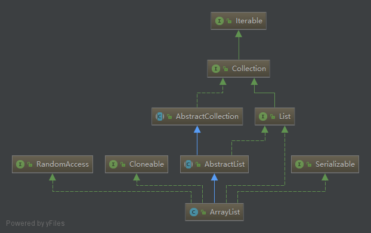
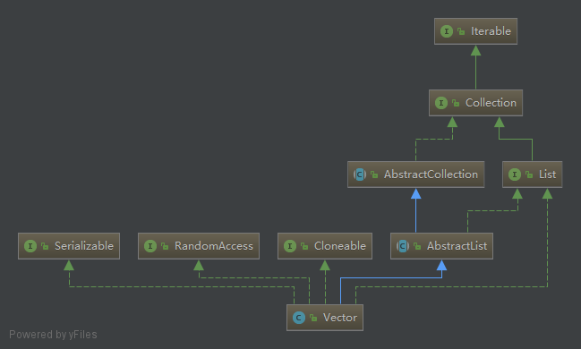
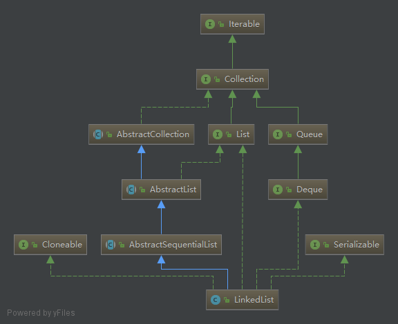

# <code>List</code>源码分析

## 〇、主要分析<code>List</code>集合的三个实现类

1. <code>ArrayList</code>
    - 底层数据结构是数组。线程不安全
2. <code>LinkedList</code>
    - 底层数据结构是链表。线程不安全
3. <code>Vector</code>
    - 底层数据结构是数组。线程安全
4. 基础内容
    - [Java实现链表、栈和队列](https://mp.weixin.qq.com/s?__biz=MzI4Njg5MDA5NA==&mid=2247484086&idx=1&sn=24127ceb5e0fed7f832f82579c4fbc19&chksm=ebd743b7dca0caa1dce912d47251548225aa59b4b48742a963ac52b05e13ec923a738ebcb836&scene=21#wechat_redirect)
    - [二叉树](https://mp.weixin.qq.com/s?__biz=MzI4Njg5MDA5NA==&mid=2247484064&idx=1&sn=ba783e3e83b8007fcdf129ec0839b6c2&chksm=ebd743a1dca0cab7eed0ba42d1c5d343d88858c17e90a803e0ce9e6644187e5297b29ffbb020&scene=21#wechat_redirect)

## 一、<code>ArrayList</code>解析


### 1、属性分析

<code>ArrayList</code>底层其实就是一个数组，<code>ArrayList</code>中有扩容这么一个概念，正因为它扩容，所以它能够实现“动态”增长；
```
// 默认的初始化大小 10
private static final int DEFAULT_CAPACITY = 10;

// 指定容量为 0 时，使用该空数组
private static final Object[] EMPTY_ELEMENTDATA = {};

// 默认返回的空数组，与上面的空数组区分以便知道如何扩张
private static final Object[] DEFAULTCAPACITY_EMPTY_ELEMENTDATA = {};

// 保存添加到List中的元素，第一次添加将扩容至 DEFAULT_CAPACITY
transient Object[] elementData; // non-private to simplify nested class access

// The size of the ArrayList (the number of elements it contains).
private int size;

// AbstractList 抽象类中的属性，The number of times this list has been structurally modified. Structural modifications are those that change the size of the list, or otherwise perturb it in such a fashion that iterations in progress may yield incorrect results.
protected transient int modCount = 0;
```

### 2、构造方法

三种构造方式：指定扩张容量；默认扩张容量10；用<code>Collection</code>实例来指定初始化的元素内容；
```
// Constructs an empty list with the specified initial capacity
public ArrayList(int initialCapacity) {
    if (initialCapacity > 0) {
        this.elementData = new Object[initialCapacity];
    } else if (initialCapacity == 0) {
        this.elementData = EMPTY_ELEMENTDATA;   // 并没有使用 DEFAULTCAPACITY_EMPTY_ELEMENTDATA
    } else {
        throw new IllegalArgumentException("Illegal Capacity: "+
                                            initialCapacity);
    }
}

// Constructs an empty list with an initial capacity of 10.
public ArrayList() {
    this.elementData = DEFAULTCAPACITY_EMPTY_ELEMENTDATA;
}

// Constructs a list containing the elements of the specified collection, in the order they are returned by the collection's iterator.
public ArrayList(Collection<? extends E> c) {
    elementData = c.toArray();
    if ((size = elementData.length) != 0) {
        // c.toArray might (incorrectly) not return Object[] (see 6260652)
        if (elementData.getClass() != Object[].class)
            elementData = Arrays.copyOf(elementData, size, Object[].class);
    } else {
        // replace with empty array.
        this.elementData = EMPTY_ELEMENTDATA;
    }
}
```

### 3、add 方法

1. public boolean add(E e)：向末尾添加一个元素
    - 检查是否需要扩容：size + 1 > elementData.length;
        - 不够则扩容到原来的 1.5倍
        - 第一次扩容后，如果容量还是小于minCapacity，就将容量扩充为minCapacity。
        - 与 MAX_ARRAY_SIZE 比较，小于：容量足够
        - 大于：扩容到 Integer.MAX_VALUE
    - 插入元素：elementData[size++] = e;
    ```
    public boolean add(E e) {
        // 确保内部容量足够，最小需要当前size+1
        ensureCapacityInternal(size + 1);  // 确保容量足够，最少需要 size+1
        elementData[size++] = e;    // 对于元素本身的添加十分简单暴力
        return true;
    }
    private void ensureCapacityInternal(int minCapacity) {
        ensureExplicitCapacity(calculateCapacity(elementData, minCapacity));
    }
    private void ensureExplicitCapacity(int minCapacity) {
        modCount++;

        // overflow-conscious code
        if (minCapacity - elementData.length > 0)
            grow(minCapacity);  // 容量不够时需要扩容
    }
    private static int calculateCapacity(Object[] elementData, int minCapacity) {
        if (elementData == DEFAULTCAPACITY_EMPTY_ELEMENTDATA) {
            return Math.max(DEFAULT_CAPACITY, minCapacity);
        }
        return minCapacity;
    }

    // 扩容函数
    private void grow(int minCapacity) {
        // overflow-conscious code
        int oldCapacity = elementData.length;
        // oldCapacity >> 1 相当于 (int) Math.floor(a/2)，每次的容量增长都是现有大小的一半下取整
        int newCapacity = oldCapacity + (oldCapacity >> 1);
        if (newCapacity - minCapacity < 0)  // 1.5倍扩容之后还是不够，直接赋为当前需要的最小容量
            newCapacity = minCapacity;
        if (newCapacity - MAX_ARRAY_SIZE > 0)
            newCapacity = hugeCapacity(minCapacity);
        // minCapacity is usually close to size, so this is a win:
        elementData = Arrays.copyOf(elementData, newCapacity);  // 将数组按照新容量来复制
    }

    // 扩张的容量超过数组最大容量时，将使用Integer的最大值Integer.MAX_VALUE
    // Some VMs reserve some header words in an array
    private static final int MAX_ARRAY_SIZE = Integer.MAX_VALUE - 8;
    private static int hugeCapacity(int minCapacity) {
        if (minCapacity < 0) // overflow
            throw new OutOfMemoryError();
        return (minCapacity > MAX_ARRAY_SIZE) ?
            Integer.MAX_VALUE :
            MAX_ARRAY_SIZE;
    }

    // Arrays
    public static <T,U> T[] copyOf(U[] original, int newLength, Class<? extends T[]> newType) {
        @SuppressWarnings("unchecked")
        T[] copy = ((Object)newType == (Object)Object[].class)
            ? (T[]) new Object[newLength]
            : (T[]) Array.newInstance(newType.getComponentType(), newLength);
        // src,srcPos,des,desPos,length
        System.arraycopy(original, 0, copy, 0,
                            Math.min(original.length, newLength));
        return copy;
    }
    ```
    - <code>ArrayList</code>的扩张要把整个数组复制一遍，扩容成本较大；
    - <code>ArrayList</code>的 size 属性是<code>ArrayList</code>的长度，而内部的<code>elementData</code>的长度则为其容量 Capacity；
    - 如果不知道 size 属性的值，那么将无法得到<code>ArrayList</code>的长度，只知道它的长度不会超过<code>elementData</code>的长度，因为<code>ArrayList</code>允许添加多个 null，根本是由于<code>elementData</code>允许添加多个 null，从而导致分析<code>elementData</code>的具体元素并不能得到有效结果（比如误以为最后一个不为null元素为终点）；<code>ArrayList</code>的长度需要在增删改查中不断及时维护；

2. public void add(int index, E element)：向末尾添加一个元素
    - 检查index是否合法
    - 检查是否需要进行扩容（同add(E e)）
    - index及之后的元素后移一位
    - 插入元素
    ```
    public void add(int index, E element) {
        rangeCheckForAdd(index);    // 不允许 index > size || index < 0
        ensureCapacityInternal(size + 1);  // 确保容量足够，最少需要 size+1
        System.arraycopy(elementData, index, elementData, index + 1,
                         size - index); // 将index后的所有元素整体后移一位
        elementData[index] = element;   // 在空出来的index位置插入新元素
        size++; // 维护 ArrayList 大小
    }
    // System，这个函数由C/C++实现
    public static native void arraycopy(Object src,  int  srcPos, Object dest, int destPos, int length);
    ```


### 4、get 方法
- 检查index合法性；
- 返回数组index处的元素；
    ```
    public E get(int index) {
        rangeCheck(index);  // 
        return elementData(index);
    }
    // index范围检查，但是无需检查非负，因为负数下标访问数组会抛出 ArrayIndexOutOfBoundsException
    private void rangeCheck(int index) {
        if (index >= size)
            throw new IndexOutOfBoundsException(outOfBoundsMsg(index));
    }
    ```

### 5、set 方法
- 替换特定位置的元素
    ```
    public E set(int index, E element) {
        rangeCheck(index);              // index检查
        E oldValue = elementData(index);// 获取旧值
        elementData[index] = element;   // 设置新值
        return oldValue;                // 返回旧值
    }
    ```

### 6、remove 方法
- 删除特定位置的元素
- 删除元素时不会减少容量，若希望减少容量则调用 trimToSize()
    ```
    public E remove(int index) {
        rangeCheck(index);  // 检查index合法性
        modCount++;         // 结构性修改次数++
        E oldValue = elementData(index); // 获取旧值
        int numMoved = size - index - 1; // 需要前移的元素个数
        if (numMoved > 0)
            System.arraycopy(elementData, index+1, elementData, index, numMoved); // 将index+1开始的numMoved个元素以此拷贝到自index开始的位置 
        elementData[--size] = null; // clear to let GC do its work，最后一位的元素需要清除
        return oldValue;
    }
    
    // 减小容量到与 size 一致
    public void trimToSize() {
        modCount++;
        if (size < elementData.length) {
            elementData = (size == 0)
              ? EMPTY_ELEMENTDATA
              : Arrays.copyOf(elementData, size);
        }
    }
    ```


## 二、<code>Vector</code>解析

### 1、与<code>ArrayList</code>区别

1. <code>Vector</code>底层也是数组，与<code>ArrayList</code>最大的区别就是：同步(线程安全)；
2. <code>ArrayList</code>在底层数组不够用时在原来的基础上扩展0.5倍，<code>Vector</code>是扩展1倍；
3. 现在已少用，被<code>ArrayList</code>替代，原因有两个：
    - <code>Vector</code>所有方法都是同步，有性能损失。
    - <code>Vector</code>初始length是10 超过length时 以100%比率增长，相比于<code>ArrayList</code>更多消耗内存。

### 2、并不推荐使用<code>Vector</code>
1. 如果想要<code>ArrayList</code>实现同步，可以使用<code>Collections</code>的方法：List list = Collections.synchronizedList(new ArrayList(...));


## 三、<code>LinkedList</code>解析


1. <code>LinkedList</code>底层是双向链表，[参考](https://mp.weixin.qq.com/s?__biz=MzI4Njg5MDA5NA==&mid=2247484086&idx=1&sn=24127ceb5e0fed7f832f82579c4fbc19&chksm=ebd743b7dca0caa1dce912d47251548225aa59b4b48742a963ac52b05e13ec923a738ebcb836&scene=21#wechat_redirect)
2. <code>LinkedList</code>实现了<code>List</code>、<code>Deque</code>两个接口，具备了队列和栈的操作

### 1、属性分析
```
transient int size = 0;

/**
 * 头节点：非空时，头节点的前驱为空，且自身元素值不为空
 * Invariant: (first == null && last == null) ||
 *            (first.prev == null && first.item != null)
 */
transient Node<E> first;

/**
 * 尾节点：非空时，尾节点的后继为空，且自身元素值不为空
 * Invariant: (first == null && last == null) ||
 *            (last.next == null && last.item != null)
 */
transient Node<E> last;

// 实现节点的的内部类
private static class Node<E> {
    E item;
    Node<E> next;
    Node<E> prev;
            // 前驱，   元素值，    后继
    Node(Node<E> prev, E element, Node<E> next) {
        this.item = element;
        this.next = next;
        this.prev = prev;
    }
}
```

### 2、构造方法

```
public LinkedList() { }

// 用特定的Collection来初始化
public LinkedList(Collection<? extends E> c) {
    this();
    addAll(c);
}
```

### 3、add 方法
- 往链表最后添加元素
```
public boolean add(E e) {
    linkLast(e);
    return true;
}
// 将e作为最后一个元素连接到链表
void linkLast(E e) {
    final Node<E> l = last; // 临时保存现尾节点
    final Node<E> newNode = new Node<>(l, e, null); // 构造新节点，前驱为现尾节点，后继为nul
    last = newNode; // 修改尾节点为当前
    if (l == null)  // 当为第一个元素
        first = newNode;
    else
        l.next = newNode;
    size++;
    modCount++;
}
```

### 4、remove 方法

```
// 删除元素
public boolean remove(Object o) {
    if (o == null) {
        for (Node<E> x = first; x != null; x = x.next) {
            if (x.item == null) {
                unlink(x);
                return true;
            }
        }
    } else {
        for (Node<E> x = first; x != null; x = x.next) {
            if (o.equals(x.item)) {
                unlink(x);
                return true;
            }
        }
    }
    return false;
}

// 取消一个节点的连接
E unlink(Node<E> x) {
    // assert x != null;
    final E element = x.item;   // 另存元素值
    final Node<E> next = x.next;// 另存后继
    final Node<E> prev = x.prev;// 另存前驱

    // 先解决前驱的后继
    if (prev == null) {
        first = next;
    } else {
        prev.next = next;
        x.prev = null;
    }

    // 再解决后继的前驱
    if (next == null) {
        last = prev;
    } else {
        next.prev = prev;
        x.next = null;
    }

    x.item = null;  // 将独立Node值置为空
    size--;
    modCount++;
    return element;
}
```

### 5、get 方法

```
public E get(int index) {
    checkElementIndex(index);   // index >= 0 && index < size;
    return node(index).item;
}

// 根据index获取节点
Node<E> node(int index) {
    if (index < (size >> 1)) {  // 前半部分
        Node<E> x = first;
        for (int i = 0; i < index; i++) // 头遍历
            x = x.next;
        return x;
    } else {    // 后半部分
        Node<E> x = last;
        for (int i = size - 1; i > index; i--)  // 尾遍历
            x = x.prev;
        return x;
    }
}
```

### 6、set 方法
```
public E set(int index, E element) {
    checkElementIndex(index);   // index >= 0 && index < size;
    Node<E> x = node(index);    // 另存当前位置节点
    E oldVal = x.item;      // 另存旧值
    x.item = element;       // 设置新值
    return oldVal;
}
```

## 总结

1. 总的来说：查询多用ArrayList，增删多用LinkedList
2. ArrayList增删慢不是绝对的(在数量大的情况下)：
    - 如果增加元素一直是使用add()(增加到末尾)的话，那是ArrayList要快
    - 一直删除末尾的元素也是ArrayList要快【不用复制移动位置】
    - 至于如果删除的是中间的位置的话，还是ArrayList要快！
